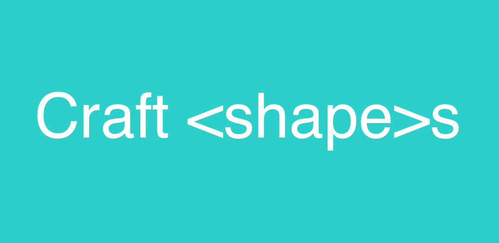

# GradientDrawableTuner

Get confusing about the <shape> drawable in Android? Try playing with `GradientDrawableTuner`! With the `GradientDrawableTuner`, you can see how the properties of `GradientDrawable` affect the Drawable's appearance, intuitively.

[][1]

[][1]

## Screen shots

    

 [1]: https://play.google.com/store/apps/details?id=top.defaults.gradientdrawabletuner