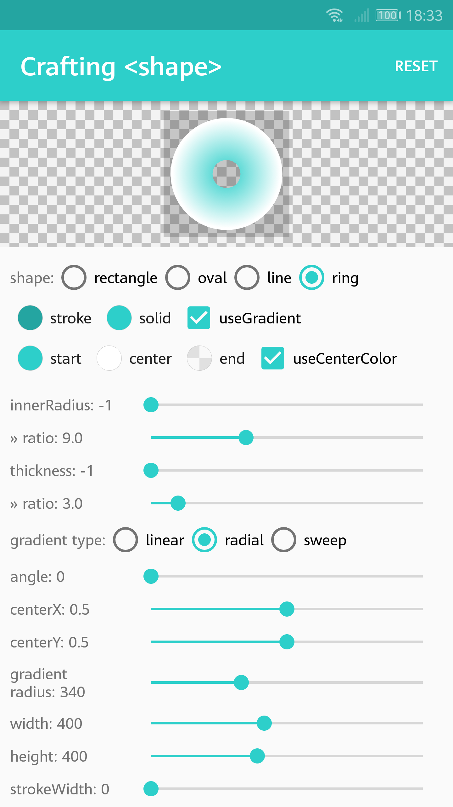

# GradientDrawableTuner   

[English](README.md) | 中文

无法清楚的理解<shape>中各种属性的含义吗？通过使用`GradientDrawableTuner`，你可以通过调节和设置各种属性值并实时、直观地预览<shape>的实际效果。`GradientDrawableTuner`还提供了生成对应的xml代码的功能。

## 特性

* 几乎支持调节`<shape>`的所有属性
* 生成当前<shape>所对应的xml代码

## 屏幕截图

     

## 相关库列表

* [DrawableToolbox](https://github.com/duanhong169/DrawableToolbox)
* [ColorPicker](https://github.com/duanhong169/ColorPicker)
* [CheckerboardDrawable](https://github.com/duanhong169/CheckerboardDrawable)

## LICENSE

   Copyright 2018 Hong Duan

   Licensed under the Apache License, Version 2.0 (the "License");
   you may not use this file except in compliance with the License.
   You may obtain a copy of the License at

       http://www.apache.org/licenses/LICENSE-2.0

   Unless required by applicable law or agreed to in writing, software
   distributed under the License is distributed on an "AS IS" BASIS,
   WITHOUT WARRANTIES OR CONDITIONS OF ANY KIND, either express or implied.
   See the License for the specific language governing permissions and
   limitations under the License.